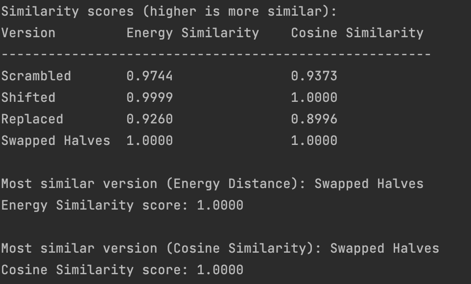

### Install
```bash
pip install -r requirements.txt
git clone https://huggingface.co/LoganKilpatrick/GoogleNews-vectors-negative300
gzip -dk GoogleNews-vectors-negative300/GoogleNews-vectors-negative300.bin.gz
python -m venv .venv
```

### Run
```bash
source .venv/bin/activate
python -m main.py
```

### Test Results
